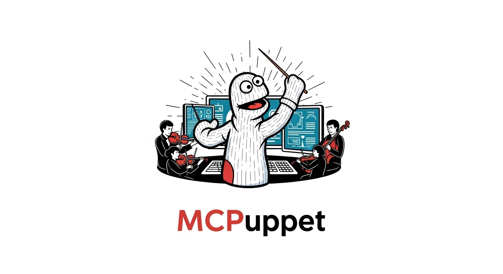

# MCPuppet

A proof of concept MCP Workflow Orchestrator that demonstrates workflow monitoring, audit logging, and policy-based execution ordering for AI applications using MCP tools.

## Features

- **Workflow Orchestration**: Acts as MCP server to AI applications and MCP client to downstream servers
- **Policy Enforcement**: Sequential dependencies, parallel restrictions, conditional execution, and approval gates
- **Comprehensive Audit Logging**: Complete audit trail of all tool calls and workflow activities
- **Real-time Monitoring**: Live workflow status tracking and progress monitoring
- **Template-based Workflows**: Predefined workflow patterns for common operations
- **Policy Violation Detection**: Automatic blocking of rule violations with detailed reporting

## Architecture

```
AI Application → MCPuppet → Multiple MCP Servers → Tool Execution
                    ↓
              Audit Trail + Policy Enforcement
```

## Prerequisites

- Python 3.9+
- Virtual environment (recommended)

## Installation

1. **Clone and navigate to the project directory**
2. **Create and activate virtual environment**:
   ```bash
   python3 -m venv venv
   source venv/bin/activate
   ```
3. **Install dependencies**:
   ```bash
   pip install -r requirements.txt
   ```

## Claude Desktop Integration

To use this as an MCP server with Claude Desktop:

1. **Test the MCP server**:
   ```bash
   source venv/bin/activate
   python test_mcp_server.py
   ```

2. **Configure Claude Desktop** by adding this to your `claude_desktop_config.json`:
   ```json
   {
     "mcpServers": {
       "workflow-orchestrator": {
         "command": "/path/to/your/project/venv/bin/python",
         "args": ["/path/to/your/project/mcp_server.py"]
       }
     }
   }
   ```

3. **Restart Claude Desktop** to load the MCP server

See [CLAUDE_SETUP.md](CLAUDE_SETUP.md) for detailed setup instructions.

## Quick Start

### Run All Demos
```bash
python main.py demo
```

### Run Specific Demos
```bash
python main.py demo-success    # Successful customer onboarding workflow
python main.py demo-violation  # Policy violation enforcement demo
python main.py demo-approval   # Financial processing with approval gates
python main.py demo-monitoring # Real-time workflow monitoring
python main.py demo-audit      # Comprehensive audit trail
```

### Interactive Mode
```bash
python main.py interactive
```

### System Status
```bash
python main.py status
```

## Demo Scenarios

### 1. Successful Workflow
Demonstrates a complete customer onboarding workflow:
- Data validation → Processing → Backup → Notification
- Shows proper dependency ordering and successful completion

### 2. Policy Violation
Shows what happens when workflow rules are violated:
- Attempts to process data before validation
- Demonstrates automatic blocking and audit logging

### 3. Approval Workflow
Financial processing workflow with manual approval gates:
- Validation → Approval → Processing → Backup & Notification
- Shows approval request/response cycle

### 4. Real-time Monitoring
Live dashboard showing workflow progress:
- Progress bars and status updates
- Real-time metrics and completion tracking

### 5. Comprehensive Audit
Complete audit trail across all sessions:
- Policy violations summary
- Performance metrics
- Compliance reporting

## Configuration

Edit `config.json` to customize:
- Downstream server URLs
- Policy rules (dependencies, restrictions, conditions)
- Workflow templates
- Audit settings

## Project Structure

```
MCPuppet/
├── main.py                    # Main entry point
├── orchestrator.py            # Core workflow orchestrator
├── workflow_policies.py       # Policy engine
├── audit_monitor.py          # Audit logging and monitoring
├── workflow_templates.py     # Predefined workflow templates
├── demo_workflows.py         # Demo scenarios
├── config.json              # Configuration
├── requirements.txt         # Dependencies
├── downstream_servers/      # Simulated MCP servers
│   ├── validation_server.py
│   ├── processing_server.py
│   ├── backup_server.py
│   ├── notification_server.py
│   └── approval_server.py
└── audit_logs/              # Audit output directory
```

## Key Components

### MCPuppet Core (`orchestrator.py`)
- Acts as MCP server to AI applications
- Acts as MCP client to downstream servers  
- Enforces workflow policies and call ordering
- Provides comprehensive audit logging
- Tracks workflow state and dependencies

### Workflow Policy Engine (`workflow_policies.py`)
- Sequential Dependencies: Tool A must be called before Tool B
- Parallel Restrictions: Some tools cannot run simultaneously
- Conditional Execution: Tool C only available after Tool A succeeds
- Approval Gates: Some tools require manual approval before execution

### Audit Monitor (`audit_monitor.py`)
- Comprehensive logging of all tool calls
- Workflow compliance tracking
- Performance metrics (duration, success rates)
- Policy violation detection and reporting
- Real-time workflow status

### Workflow Templates (`workflow_templates.py`)
- Predefined sequences for common operations
- Template-based workflow execution
- Progress tracking and validation

## Monitoring Dashboard

The system provides a real-time monitoring dashboard showing:

```
┌─ Workflow Status Dashboard ─────────────────────┐
│ Active Workflows: 3                             │
│ Completed Today: 47                             │ 
│ Policy Violations: 2                            │
│                                                 │
│ Current Workflow: customer_onboarding          │
│ Progress: ████████░░ 80% (4/5 steps)           │
│ Duration: 3.2s                                  │
│ Next Step: send_notification                    │
└─────────────────────────────────────────────────┘
```

## Security & Compliance

- Complete audit trail for all MCP tool interactions
- Policy-based access control and workflow enforcement
- Comprehensive logging with structured output
- Compliance reporting and violation tracking
- Approval workflows for sensitive operations

## Testing

The system includes comprehensive demos that test:
- Workflow orchestration and execution
- Policy enforcement and violation detection
- Audit logging and compliance reporting
- Real-time monitoring and status tracking
- Template-based workflow management
- Approval gate functionality

## Example Usage

```python
# Create MCPuppet orchestrator
orchestrator = MCPOrchestrator()

# Execute workflow step
result = await orchestrator.call_tool(
    session_id="customer_123",
    tool_name="validate_data",
    arguments={"data": {"name": "John Doe", "email": "john@example.com"}}
)

# Check workflow status
status = orchestrator.get_session_status("customer_123")
```

## Contributing

This is a proof of concept demonstrating MCPuppet's workflow orchestration capabilities. The focus is on showing the value proposition of comprehensive workflow monitoring and audit capabilities for AI tool usage.

## License

This project is a demonstration/proof of concept for MCPuppet workflow orchestration.

---

## Key Value Propositions

**For Enterprises:**
- "Show me exactly what our AI did and prove it followed our policies"
- "Prevent AI from doing dangerous things in the wrong order"
- "Audit compliance for AI tool usage"

**For Developers:**
- "I can see the full workflow trace when things go wrong"
- "I can enforce business logic without changing every tool"
- "I can gradually add workflow rules without breaking existing tools"

**For AI Safety:**
- "AI can't accidentally skip safety checks"
- "Dangerous tool combinations are blocked by policy"
- "Complete audit trail for accountability"